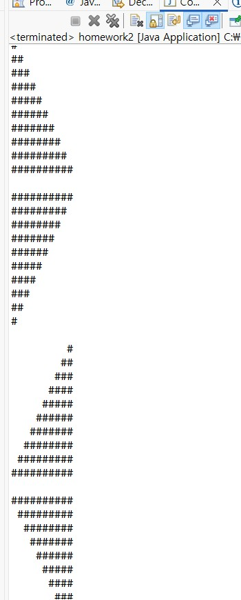
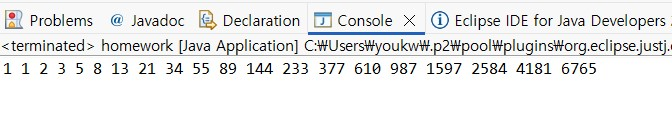
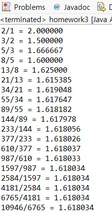
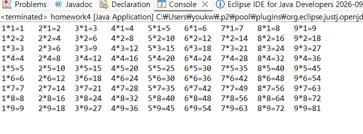

# OOP2026
### Homework1
```java
public class Homework1 {
    public static void main(String[] args) {
        int i, j;

        for (i = 0; i < 10; i++) {
            for (j = 0; j <= i; j++) {
                System.out.print("#");
            }
            System.out.println();
        }
        System.out.println();
        
        for (i = 0; i < 10; i++) {
            for (j = 0; j < 10 - i; j++) {
                System.out.print("#");
            }
            System.out.println();
        }
        System.out.println();
        
        for (i = 0; i < 10; i++) {
            for (j = 0; j < 10 - 1 - i; j++) {
                System.out.print(" ");
            }
            for (j = 0; j <= i; j++) {
                System.out.print("#");
            }
            System.out.println();
        }
        System.out.println();

        for (i = 0; i < 10; i++) {
            for (j = 0; j < i; j++) {
                System.out.print(" ");
            }
            for (j = 0; j < 10 - i; j++) {
                System.out.print("#");
            }
            System.out.println();
        }
    }
}
```

### Homwork2
```java
public class Homework2 {
    public static void main(String[] args) {
        int i;
    	int n = 20;
        int[] fibo = new int[n];

        fibo[0] = 1;
        fibo[1] = 1;

        for (i = 2; i < n; i++) {
            fibo[i] = fibo[i - 1] + fibo[i - 2];
        }

        for (i = 0; i < n; i++) {
            System.out.print(fibo[i] + " ");
        }
        System.out.println();
    }
}
```

### Homework3
```java
public class Homework3 {
    public static void main(String[] args) {
        int i;
    	int n = 21;
        long[] fibo = new long[n];

        fibo[0] = 1;
        fibo[1] = 1;

        for (i = 2; i < n; i++) {
            fibo[i] = fibo[i - 1] + fibo[i - 2];
        }
        for (i = 1; i < n - 1; i++) {
            double ratio = (double) fibo[i + 1] / fibo[i];
            System.out.printf("%d/%d = %.6f%n", fibo[i + 1], fibo[i], ratio);
        }
    }
}
```

### Homework4
```java
public class homework4 {
    public static void main(String[] args) {
        int i, j;
    	for (i = 1; i <= 9; i++) {
            for (j = 1; j <= 9; j++) {
                System.out.printf("%d*%d=%-2d\t", j, i, j * i);
            }
            System.out.println();
        }
    }
}
```

```java
	public static void Histogram(String[] args) {
		// TODO Auto-generated method stub
		int array_count, max_value, bin_size, display_scale, hist_size;
		if(args.length !=4)
			return;
		array_count = Integer.parseInt(args[0]);
		max_value = Integer.parseInt(args[1]);
		bin_size = Integer.parseInt(args[2]);
		display_scale = Integer.parseInt(args[3]);
		hist_size = max_value/bin_size;
		
		int[] arr = new int[array_count];
		int[] hist = new int[hist_size];
		for (int i=0; i<array_count; i++) {
			arr[i] = (int) (Math.random()*max_value);
		}
		for (int i=0; i<array_count; i++) {
			System.out.print(arr[i] + " ");  
		}
		System.out.println();  
		
		for (int i=0; i<array_count; i++) {
			hist[arr[i]/bin_size]++;
		}
		for (int i=0; i<hist_size; i++) {
			System.out.print(hist[i] + " ");  
		}
		System.out.println();  
	}
```
```java
	public static void main(String[] args) {
		// TODO Auto-generated method stub
		int array_count;
		if(args.length !=1)
			return;
		array_count = Integer.parseInt(args[0]);
		int[] arr = new int[array_count];
		for (int i=0; i<array_count; i++) {
			arr[i] = (int) (Math.random()*100);
		}
		for (int i=0; i<array_count; i++) {
			System.out.print(arr[i] + " ");  
		}
		System.out.println();
		double sum = 0;
		for (int i=0; i<array_count; i++) {
			sum+=arr[i];
		}
		System.out.printf("arithematic mean : = %f\n", sum/array_count);
		double prod = 1;
		for (int i=0; i<array_count; i++) {
			prod*=arr[i];
		}
		System.out.printf("harmonic mean : = %f\n", Math.pow(prod, (double)1./array_count));
		
	}
```
