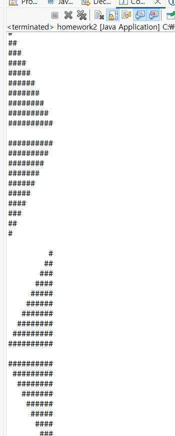
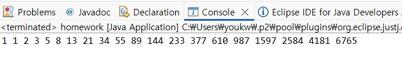
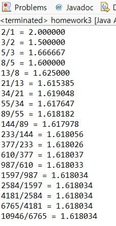
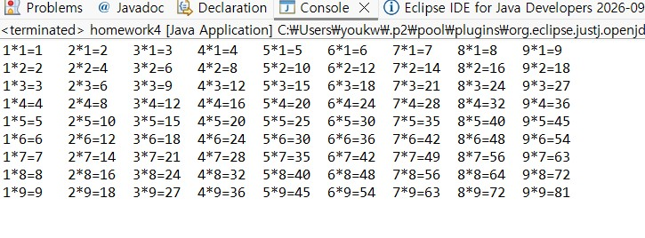
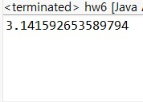
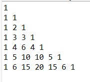
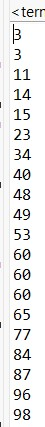
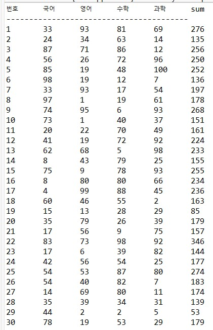

# OOP2026
### Homework1
```java
public class Homework1 {
    public static void main(String[] args) {
        int i, j;

        for (i = 0; i < 10; i++) {
            for (j = 0; j <= i; j++) {
                System.out.print("#");
            }
            System.out.println();
        }
        System.out.println();
        
        for (i = 0; i < 10; i++) {
            for (j = 0; j < 10 - i; j++) {
                System.out.print("#");
            }
            System.out.println();
        }
        System.out.println();
        
        for (i = 0; i < 10; i++) {
            for (j = 0; j < 10 - 1 - i; j++) {
                System.out.print(" ");
            }
            for (j = 0; j <= i; j++) {
                System.out.print("#");
            }
            System.out.println();
        }
        System.out.println();

        for (i = 0; i < 10; i++) {
            for (j = 0; j < i; j++) {
                System.out.print(" ");
            }
            for (j = 0; j < 10 - i; j++) {
                System.out.print("#");
            }
            System.out.println();
        }
    }
}
```

### Homwork2
```java
public class Homework2 {
    public static void main(String[] args) {
        int i;
    	int n = 20;
        int[] fibo = new int[n];

        fibo[0] = 1;
        fibo[1] = 1;

        for (i = 2; i < n; i++) {
            fibo[i] = fibo[i - 1] + fibo[i - 2];
        }

        for (i = 0; i < n; i++) {
            System.out.print(fibo[i] + " ");
        }
        System.out.println();
    }
}
```

### Homework3
```java
public class Homework3 {
    public static void main(String[] args) {
        int i;
    	int n = 21;
        long[] fibo = new long[n];

        fibo[0] = 1;
        fibo[1] = 1;

        for (i = 2; i < n; i++) {
            fibo[i] = fibo[i - 1] + fibo[i - 2];
        }
        for (i = 1; i < n - 1; i++) {
            double ratio = (double) fibo[i + 1] / fibo[i];
            System.out.printf("%d/%d = %.6f%n", fibo[i + 1], fibo[i], ratio);
        }
    }
}
```

### Homework4
```java
public class homework4 {
    public static void main(String[] args) {
        int i, j;
    	for (i = 1; i <= 9; i++) {
            for (j = 1; j <= 9; j++) {
                System.out.printf("%d*%d=%-2d\t", j, i, j * i);
            }
            System.out.println();
        }
    }
}
```

### Homework5
```java
public class homework5 {
	public static void main(String[] args) {
		int i, n = 100, sign = 1;
		double sum = 0;
		for(i=0;i<n;i++) {
			sum += sign*1./((2.*i+1)*Math.pow(3., i));
			sign*= -1;
		}
		System.out.println(sum*Math.sqrt(12));
		}
	}
```

### Homework6
```Java
public class homework6 {
    public static void main(String[] args) {
        int n = 7;
        int[][] binomial = new int[n][n];

        for (int i = 0; i < n; i++) {
            for (int j = 0; j <= i; j++) {
                if (j == 0 || j == i) {
                    binomial[i][j] = 1;
                } else {
                    binomial[i][j] = binomial[i - 1][j - 1] + binomial[i - 1][j];
                }
            }
        }

        for (int i = 0; i < n; i++) {
            for (int j = 0; j <= i; j++) {
                System.out.print(binomial[i][j] + " ");
            }
            System.out.println();
        }
    }
}
```

### Homework7
```Java
public class homework7 {
    public static void main(String[] args) {
        int data[] = new int[20];
        
        for (int i = 0; i < 20; i++) {
            data[i] = (int)(Math.random() * 100);
        }
        
        for (int i = 0; i < data.length - 1; i++) {
            int minIndex = i;
            for (int j = i + 1; j < data.length; j++) {
                if (data[j] < data[minIndex]) {
                    minIndex = j;
                }
            }
            int temp = data[i];
            data[i] = data[minIndex];
            data[minIndex] = temp;
        }

        for (int i = 0; i < 20; i++) {
            System.out.println(data[i]);
        }
    }
}
```

### Homework8
```Java
public class homework8 {
    public static void main(String[] args) {
        int studentCount = 30; 
        int score[][] = new int[studentCount][5]; 

        for (int i = 0; i < studentCount; i++) {
            for (int j = 0; j < 4; j++) {
                score[i][j] = (int)(Math.random() * 101);
            }
        }

        System.out.println("번호\t국어\t영어\t수학\t과학\tsum");
        System.out.println("----------------------------------------");

        for (int i = 0; i < studentCount; i++) {
            int sum = 0;
            System.out.print((i + 1) + "\t");

            for (int j = 0; j < 4; j++) {
                System.out.print(score[i][j] + "\t");
                sum += score[i][j];
            }
            
            System.out.println(sum);
        }
    }
}

```


```java
	public static void main(String[] args) {
		// TODO Auto-generated method stub
		int array_count;
		if(args.length !=1)
			return;
		array_count = Integer.parseInt(args[0]);
		int[] arr = new int[array_count];
		for (int i=0; i<array_count; i++) {
			arr[i] = (int) (Math.random()*100);
		}
		for (int i=0; i<array_count; i++) {
			System.out.print(arr[i] + " ");  
		}
		System.out.println();
		double sum = 0;
		for (int i=0; i<array_count; i++) {
			sum+=arr[i];
		}
		System.out.printf("arithematic mean : = %f\n", sum/array_count);
		double prod = 1;
		for (int i=0; i<array_count; i++) {
			prod*=arr[i];
		}
		System.out.printf("harmonic mean : = %f\n", Math.pow(prod, (double)1./array_count));
		
	}
```
```java
public class hw6 {
	public static void main(String[] args) {
		int i, n = 100, sign = 1;
		double sum = 0;
		for(i=0;i<n;i++) {
			sum += sign*4./(2.*i+1.);
			sign*= -1;
		}
		System.out.println(sum);
		}
	}
```
```java
public class hw6 {
	public static void main(String[] args) {
		int i, n = 100, sign = 1;
		double sum = 0;
		for(i=0;i<n;i++) {
			sum += sign*1./((2.*i+1)*Math.pow(3., i));
			sign*= -1;
		}
		System.out.println(sum*Math.sqrt(12));
		}
	}
```
